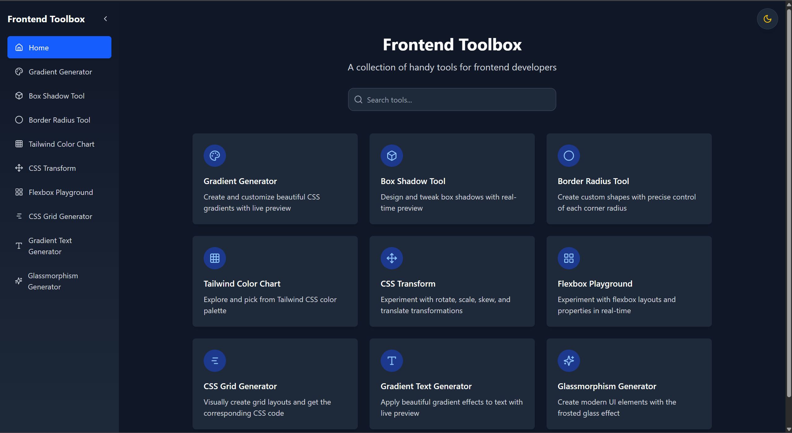

# Frontend Toolbox 🧰

A comprehensive collection of essential CSS tools and generators for web developers. Built with React, Vite, and Tailwind CSS, providing real-time previews and instant code generation.



## ✨ Features

### 🎨 CSS Generators
- **Gradient Generator** - Create stunning linear and radial gradients with multiple color stops
- **Box Shadow Tool** - Design and customize box shadows with live preview
- **Border Radius Generator** - Create custom shapes with precise control of each corner
- **Gradient Text Generator** - Apply beautiful gradient effects to text
- **Glassmorphism Generator** - Create modern frosted glass UI effects

### 🔧 Layout Tools
- **Flexbox Playground** - Experiment with flexbox layouts and properties
- **CSS Grid Generator** - Visually create grid layouts and get CSS code
- **CSS Transform Tool** - Test rotate, scale, skew, and translate transformations

### 🎯 Design Resources
- **Tailwind Color Chart** - Explore and pick from the complete Tailwind CSS palette
- **Pre-built Presets** - Quick access to popular design patterns and effects

## 🚀 Getting Started

### Prerequisites
- Node.js (version 16 or higher)
- npm or yarn package manager

### Installation

1. **Clone the repository**
   ```bash
   git clone https://github.com/yourusername/frontend-toolbox.git
   cd frontend-toolbox
   ```

2. **Install dependencies**
   ```bash
   npm install
   # or
   yarn install
   ```

3. **Start the development server**
   ```bash
   npm run dev
   # or
   yarn dev
   ```

4. **Open your browser**
   Navigate to `http://localhost:5173` to see the application.

## 🛠️ Built With

- **[React 19](https://reactjs.org/)** - User interface library
- **[Vite](https://vitejs.dev/)** - Next generation frontend tooling
- **[Tailwind CSS 4](https://tailwindcss.com/)** - Utility-first CSS framework
- **[React Router](https://reactrouter.com/)** - Declarative routing for React
- **[Lucide React](https://lucide.dev/)** - Beautiful and consistent icons
- **[React Hot Toast](https://react-hot-toast.com/)** - Smoking hot notifications

## 📁 Project Structure

```
frontend-toolbox/
├── public/                 # Static assets
├── src/
│   ├── components/        # Reusable UI components
│   │   ├── Sidebar.jsx   # Navigation sidebar
│   │   ├── ThemeToggle.jsx # Dark/light mode toggle
│   │   └── ToolCard.jsx  # Tool preview cards
│   ├── context/          # React context providers
│   │   └── ThemeContext.jsx # Theme management
│   ├── data/            # Static data and presets
│   │   ├── gradientPresets.json
│   │   ├── shadowPresets.json
│   │   ├── borderRadiusPresets.json
│   │   ├── tailwindColors.json
│   │   └── toolsData.js
│   ├── pages/           # Individual tool pages
│   │   ├── Home.jsx
│   │   ├── GradientGenerator.jsx
│   │   ├── ShadowGenerator.jsx
│   │   ├── BorderRadius.jsx
│   │   ├── TailwindChart.jsx
│   │   ├── Transform.jsx
│   │   ├── Flexbox.jsx
│   │   ├── CSSGrid.jsx
│   │   ├── GradientText.jsx
│   │   └── GlassmorphismGenerator.jsx
│   ├── App.jsx          # Main application component
│   ├── main.jsx         # Application entry point
│   └── index.css        # Global styles
├── package.json
├── vite.config.js
├── tailwind.config.js
└── README.md
```

## 🎯 Available Tools

### 1. Gradient Generator
- Create linear and radial gradients
- Multiple color stops support
- Real-time preview
- CSS and Tailwind output
- Preset collection

### 2. Box Shadow Generator
- Multiple shadow types (subtle, harsh, material, colored, etc.)
- Layered shadows support
- Inner/outer shadow options
- Extensive preset library

### 3. Border Radius Tool
- Individual corner control
- Visual shape preview
- Quick presets for common shapes
- Copy-ready CSS code

### 4. Flexbox Playground
- Interactive flexbox property testing
- Visual container and item controls
- Real-time layout updates
- Generated CSS output

### 5. CSS Grid Generator
- Visual grid layout builder
- Responsive grid templates
- Gap and alignment controls
- Complete CSS grid code

### 6. Gradient Text
- Text gradient effects
- Multiple font options
- Size and weight controls
- Cross-browser compatible output

### 7. Glassmorphism Generator
- Modern frosted glass effects
- Blur and transparency controls
- Background options
- CSS backdrop-filter support

### 8. CSS Transform Tool
- Rotate, scale, skew, translate
- 3D transform support
- Interactive controls
- Transform origin settings

### 9. Tailwind Color Chart
- Complete Tailwind CSS palette
- Color value copying
- HSL, RGB, and HEX formats
- Search and filter functionality

## 🎨 Features

- **🌙 Dark/Light Mode** - Toggle between themes
- **📱 Responsive Design** - Works on all device sizes
- **⚡ Real-time Preview** - See changes instantly
- **📋 One-click Copy** - Copy CSS code with single click
- **🎯 Preset Library** - Quick access to popular styles
- **🔍 SEO Optimized** - Comprehensive metadata
- **♿ Accessible** - ARIA labels and keyboard navigation

## 🚦 Available Scripts

- `npm run dev` - Start development server
- `npm run build` - Build for production
- `npm run preview` - Preview production build
- `npm run lint` - Run ESLint

## 🤝 Contributing

Contributions are welcome! Please feel free to submit a Pull Request.

1. Fork the project
2. Create your feature branch (`git checkout -b feature/AmazingFeature`)
3. Commit your changes (`git commit -m 'Add some AmazingFeature'`)
4. Push to the branch (`git push origin feature/AmazingFeature`)
5. Open a Pull Request

## 📝 License

This project is licensed under the MIT License - see the [LICENSE](LICENSE) file for details.

## 🙏 Acknowledgments

- [Tailwind CSS](https://tailwindcss.com/) for the amazing utility-first framework
- [Lucide](https://lucide.dev/) for the beautiful icon set
- [React](https://reactjs.org/) team for the excellent library
- [Vite](https://vitejs.dev/) for the lightning-fast build tool

---

Made with ❤️ for the web development community
